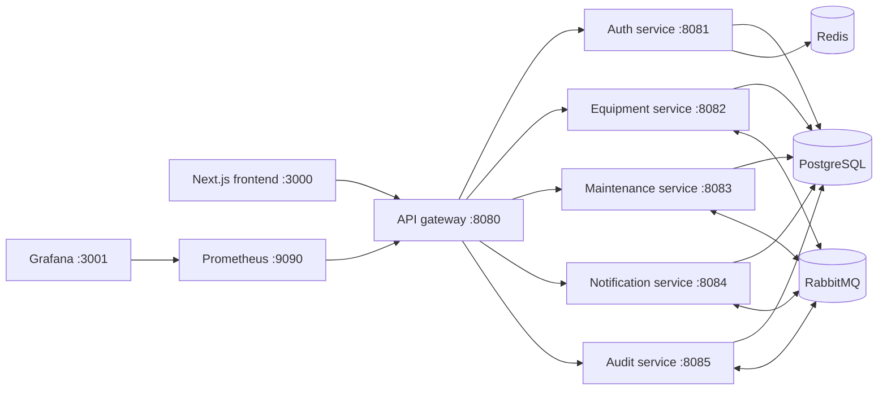

# Industrial Equipment Passport

Industrial Equipment Passport is a full-stack platform for managing the lifecycle of industrial assets. It gives operations teams one place to register equipment, track condition and downtime, plan and complete maintenance, manage spare parts, and review audit activity.

The application is containerized and can be started as a complete local environment, including its API gateway, six services, PostgreSQL, Redis, RabbitMQ, Prometheus, and Grafana.

## Features

- Equipment registry with searchable assets, status, criticality, locations, QR codes, attachments, inspections, faults, and downtime records.
- Maintenance workflow for creating, assigning, starting, placing on hold, completing, cancelling, and searching work orders.
- Spare-parts inventory with low-stock visibility, consumption tracking, and replacement history.
- JWT-based authentication, refresh-token flow, role-aware access, user administration, and permissions.
- In-app notifications and a paginated audit trail.
- Operational dashboard plus Prometheus metrics and a pre-provisioned Grafana dashboard.

## Architecture



## Tech stack

| Area | Technologies |
| --- | --- |
| Frontend | Next.js 15, React 19, TypeScript, Tailwind CSS, TanStack Query, React Hook Form, Zod, Recharts |
| Backend | Java 21, Spring Boot 3, Spring Cloud Gateway, Spring Security, Spring Data JPA, Flyway, Maven |
| Data & messaging | PostgreSQL 17, Redis 8, RabbitMQ 4 |
| Observability & testing | Spring Boot Actuator, Prometheus, Grafana, Playwright |
| Delivery | Docker and Docker Compose |

## Quick start

### Prerequisites

- Docker Engine with Docker Compose v2
- At least 6 GB of available Docker memory is recommended for the full local stack

### Run the full stack

```bash
git clone <your-repository-url>
cd industrial-equipment-passport
cp .env.example .env
```

Edit `.env` before sharing or deploying the project. In particular, replace `JWT_SECRET` with a strong random value of at least 32 bytes and use non-default database, Redis, and RabbitMQ passwords outside local development.

```bash
docker compose up --build -d
docker compose ps
```

Open [http://localhost:3000](http://localhost:3000) once the containers are healthy. The initial development account is:

| Username | Password | Roles |
| --- | --- | --- |
| `admin` | `Admin123!ChangeMe` | `ADMIN`, `MANAGER` |

Change or remove this seeded account before any non-development use.

To follow startup logs or stop the environment:

```bash
docker compose logs -f
docker compose down
```

Use `docker compose down -v` only when you intentionally want to remove the local database, broker, cache, and monitoring volumes.

## Local URLs

| Service | URL |
| --- | --- |
| Web application | [http://localhost:3000](http://localhost:3000) |
| API gateway | [http://localhost:8080](http://localhost:8080) |
| RabbitMQ Management | [http://localhost:15672](http://localhost:15672) |
| Prometheus | [http://localhost:9090](http://localhost:9090) |
| Grafana | [http://localhost:3001](http://localhost:3001) |

Grafana's local development credentials are `admin` / `admin`; change them for any shared environment.

## API overview

All client requests should go through the gateway at `http://localhost:8080`. Protected requests require an `Authorization: Bearer <access-token>` header.

| Area | Gateway path | Examples |
| --- | --- | --- |
| Authentication | `/api/v1/auth/**` | `POST /login`, `POST /refresh`, `POST /logout` |
| Users & administration | `/api/v1/users/**`, `/api/v1/admin/**` | Current user, users, role and permission management |
| Equipment | `/api/v1/equipment/**` | Assets, catalog, QR codes, inspections, faults, downtime, attachments, spare parts |
| Maintenance | `/api/v1/maintenance/**`, `/api/v1/technicians/**` | Work orders, assignment, status actions, search, attachments, technicians |
| Notifications | `/api/v1/notifications/**` | List notifications, unread count, mark as read |
| Audit | `/api/v1/audit/**` | Paginated audit history |

Example login request:

```bash
curl -X POST http://localhost:8080/api/v1/auth/login \
  -H 'Content-Type: application/json' \
  -d '{"usernameOrEmail":"admin","password":"Admin123!ChangeMe"}'
```

## Development

The Dockerfiles use multi-stage builds, so `docker compose up --build` is the simplest way to build everything. To work on components outside Docker, install Java 21, Maven, and Node.js 22, then run the relevant commands from each service directory.

```bash
# Backend service, for example equipment-service
cd backend/equipment-service
mvn spring-boot:run

# Frontend (in a second terminal)
cd frontend
npm install
npm run dev
```

Running a service locally requires the supporting PostgreSQL, Redis, and/or RabbitMQ dependencies configured in its `application.yml`. The Compose environment is the recommended starting point.

### Tests

```bash
# Backend tests, run from any backend service directory
mvn test

# End-to-end tests; start the full stack first
cd tests/e2e
npm install
npx playwright install --with-deps chromium
npm test
```

## Repository layout

```text
backend/
  api-gateway/           Spring Cloud Gateway entry point
  auth-service/          Authentication, JWTs, users, roles, permissions
  equipment-service/     Equipment lifecycle, inventory, inspections, files
  maintenance-service/   Work orders, technicians, maintenance attachments
  notification-service/  User notifications
  audit-service/         Audit-event storage and history API
frontend/                Next.js operations console
infrastructure/          PostgreSQL initialization and monitoring configuration
storage/                 Local persisted attachment directories
tests/e2e/               Playwright end-to-end tests
docker-compose.yml       Complete local development environment
```

## Configuration

Copy `.env.example` to `.env` to configure local services. The main settings are:

- `POSTGRES_*` — database names and credentials.
- `JWT_SECRET`, `JWT_ACCESS_EXPIRATION_MINUTES`, `JWT_REFRESH_EXPIRATION_DAYS` — authentication token settings.
- `REDIS_PASSWORD` and `RABBITMQ_*` — infrastructure credentials.
- `NEXT_PUBLIC_API_URL` and `CORS_ALLOWED_ORIGINS` — browser-to-API connectivity.
- `FILE_STORAGE_PATH` — attachment storage path used by applicable services.

Never commit `.env` files or production secrets.

## License

This project is licensed under the [MIT License](LICENSE).
